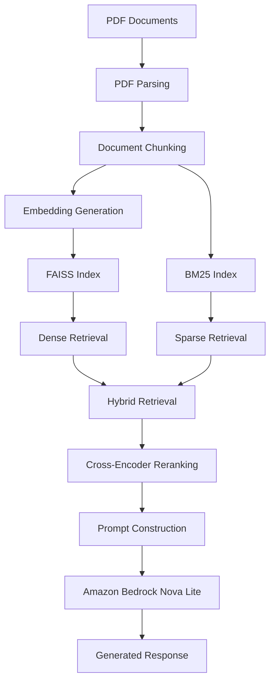
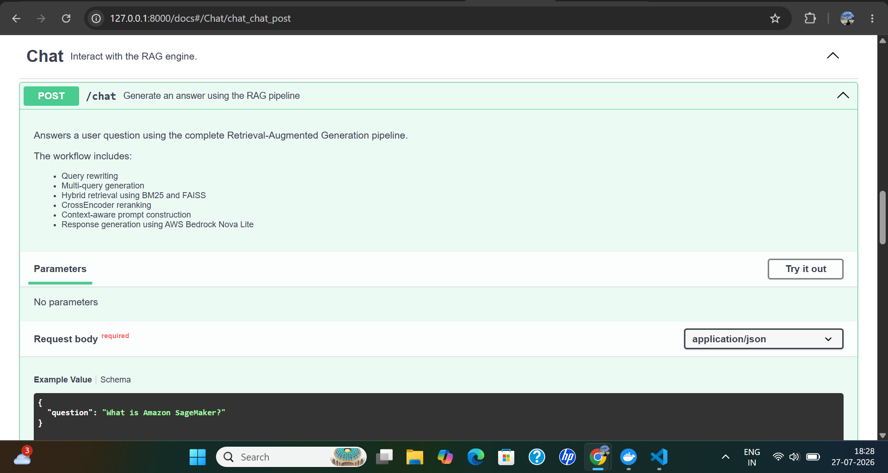
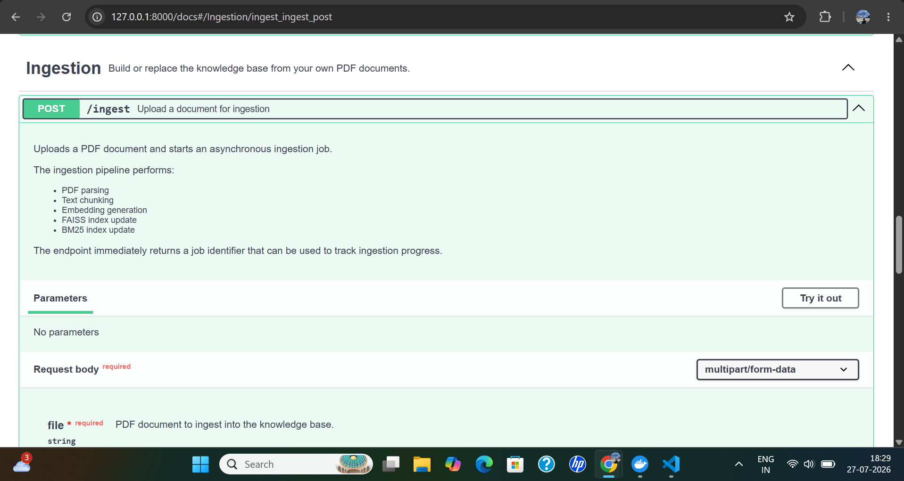
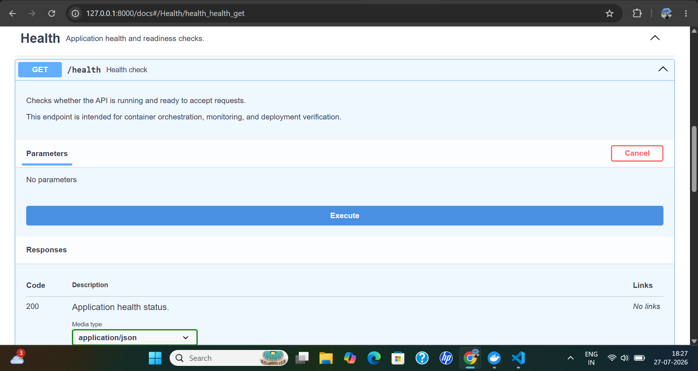
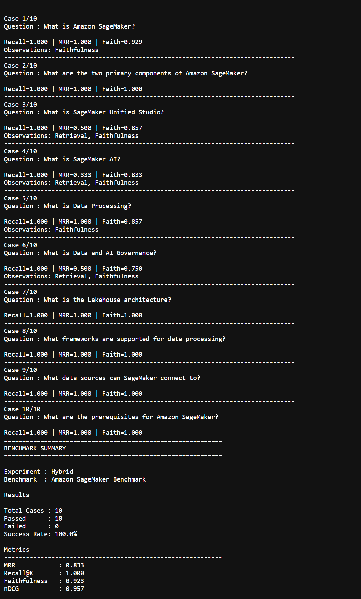

# Production AI RAG Engine

> A production-oriented Retrieval-Augmented Generation (RAG) system demonstrating document ingestion, hybrid retrieval, reranking, grounded response generation, and automated evaluation using Amazon Bedrock and FastAPI.


---
## Live Demo

🌐 Swagger UI:
http://98.82.190.68:8000/docs

❤️ Health Endpoint:
http://98.82.190.68:8000/health

---

## Architecture at a Glance

| Component | Technology |
|-----------|------------|
| LLM | Amazon Bedrock Nova Lite |
| Embeddings | Sentence Transformers |
| Retrieval | Hybrid (FAISS + BM25) |
| Reranking | Cross-Encoder |
| Backend | FastAPI |
| Evaluation | Recall@K, MRR, nDCG, Faithfulness |
| Deployment | Docker |

---

## Table of Contents

- [About this Project](#about-this-project)
- [Technology Stack](#technology-stack)
- [System Architecture](#system-architecture)
- [Request Flow](#request-flow)
- [Key Features](#key-features)
- [REST API](#rest-api)
- [Evaluation Methodology](#evaluation-methodology)
- [Evaluation Results](#evaluation-results)
- [Performance Optimization](#performance-optimization)
- [Design Decisions](#design-decisions)
- [Project Structure](#project-structure)
- [Getting Started](#getting-started)
- [Run with Docker](#run-with-docker)
- [Run Locally](#run-locally)
- [Verify the Setup](#verify-the-setup)
- [Acknowledgements](#acknowledgements)
- [Author](#author)
- [License](#license)

---

## About this Project

Retrieval-Augmented Generation (RAG) has become a standard approach for building AI applications that answer questions using external knowledge instead of relying solely on a language model's internal training.

This project demonstrates how to build a modular, production-oriented RAG system using Amazon Bedrock, FastAPI, FAISS, BM25, Sentence Transformers, and Cross-Encoder reranking.

Rather than focusing only on LLM integration, the project emphasizes the engineering practices required to build maintainable AI systems, including modular architecture, hybrid retrieval, automated evaluation, performance optimization, and containerized deployment.

Each stage of the pipeline is implemented as an independent component with clearly defined responsibilities, making the application easier to understand, test, benchmark, and extend.

---

## Technology Stack

| Category | Technology |
|-----------|------------|
| Language | Python 3.12 |
| Backend | FastAPI |
| LLM | Amazon Bedrock (Nova Lite) |
| Model Hub | Hugging Face |
| Embeddings | Sentence Transformers |
| Dense Retrieval | FAISS |
| Sparse Retrieval | BM25 |
| Reranking | Cross-Encoder |
| Evaluation | RAGAS-inspired Evaluation |
| Containerization | Docker |

---

## System Architecture



> **Architecture Diagram**  

---

## Request Flow

Every request follows the same processing pipeline from query submission to response generation.

| Stage | Description |
|--------|-------------|
| Query Processing | Receive and validate the user request. |
| Hybrid Retrieval | Retrieve relevant documents using semantic and keyword search. |
| Cross-Encoder Reranking | Improve the relevance of retrieved documents. |
| Context Construction | Build the context supplied to the language model. |
| Prompt Engineering | Generate a grounded prompt from the retrieved context. |
| LLM Inference | Generate the final response using Amazon Bedrock Nova Lite. |
| Response | Return the generated answer through the REST API. |

---

## Key Features

- PDF document ingestion
- Intelligent document chunking
- Hybrid Retrieval (FAISS + BM25)
- Cross-Encoder reranking
- Prompt construction
- Grounded response generation
- Automated evaluation framework
- Dockerized deployment
- FastAPI REST API
- Interactive Swagger documentation

---

## REST API

The application exposes a REST API built with FastAPI for document ingestion, question answering, and service monitoring. Interactive API documentation is automatically generated through OpenAPI.

## Available Endpoints

| Endpoint | Method | Description |
|----------|--------|-------------|
| `/chat` | POST | Generate grounded responses using the RAG pipeline. |
| `/ingest` | POST | Ingest PDF documents and build the knowledge base. |
| `/health` | GET | Verify application health and knowledge base readiness. |
| `/docs` | GET | Interactive Swagger UI. |

---

## Chat Endpoint

The `/chat` endpoint processes natural language queries using the complete RAG pipeline:

- Hybrid Retrieval
- Cross-Encoder Reranking
- Prompt Construction
- Amazon Bedrock Nova Lite
- Grounded Response Generation

> **Screenshot:** Chat Endpoint - 

---

## Document Ingestion

The `/ingest` endpoint processes PDF documents and prepares the retrieval indexes required by the application.

The ingestion pipeline performs:

- PDF parsing
- Document chunking
- Embedding generation
- FAISS indexing
- BM25 indexing

> **Screenshot:** Document Ingestion - 

---

## Health Check

The `/health` endpoint provides a lightweight readiness check for local development, Docker health checks, and deployment environments.

Example response:

```json
{
  "status": "healthy",
  "knowledge_base_ready": true,
  "default_knowledge_base": "Amazon SageMaker User Guide"
}
```

> **Screenshot:** Health Check - 

## Evaluation Methodology

The retrieval and generation pipeline is evaluated using a benchmark dataset derived from the **Amazon SageMaker User Guide**.

Each benchmark query is paired with an expected reference answer, allowing the retrieval pipeline and generated responses to be evaluated automatically.

The evaluation framework measures two independent aspects of the system:

- **Retrieval Quality** – How effectively the system retrieves relevant context.
- **Generation Quality** – How accurately the language model answers using the retrieved context.

---

## Retrieval Metrics

The retrieval pipeline is evaluated using standard Information Retrieval (IR) metrics.

| Metric | Description |
|---------|-------------|
| **Recall@K** | Measures whether the expected document is retrieved within the top K results. |
| **Mean Reciprocal Rank (MRR)** | Measures how highly the expected document is ranked. |
| **nDCG** | Evaluates the quality of the ranked retrieval results by considering both relevance and ranking position. |

---

## Generation Metrics

Generated responses are evaluated using a faithfulness metric inspired by the RAGAS evaluation framework.

| Metric | Description |
|---------|-------------|
| **Faithfulness** | Measures whether the generated answer is supported by the retrieved context rather than fabricated by the language model. |

---

## Evaluation Results

The benchmark was executed against a curated evaluation dataset derived from the Amazon SageMaker documentation.

## Overall Results

| Metric | Score |
|---------|------:|
| Recall@K | **1.000** |
| Mean Reciprocal Rank (MRR) | **0.833** |
| nDCG | **0.950** |
| Faithfulness | **0.922** |

---

## Benchmark Summary

| Item | Value |
|------|------:|
| Test Queries | 10 |
| Successful Evaluations | 10 |
| Failed Evaluations | 0 |
| Success Rate | **100%** |

These results indicate that the retrieval pipeline consistently identified the expected supporting documents while maintaining a high level of answer faithfulness across the benchmark dataset.

> **Screenshot:** Evaluation Report - 

---

## Performance Optimization

During development, application startup time was significantly longer than expected. Instead of replacing components immediately, the startup sequence was instrumented to measure the initialization time of each major subsystem and identify the bottleneck.

---

## Initial Measurements

| Component | Startup Time |
|-----------|-------------:|
| Embedding Model | ~39 seconds |
| Cross-Encoder Reranker | ~312 seconds |
| Total Startup Time | ~351 seconds |

The measurements showed that nearly 90% of the startup time was spent initializing the reranking model.

---

## Investigation

The following possibilities were investigated:

- Repeated model downloads
- Docker image caching
- Singleton initialization
- Memory utilization
- CPU utilization

The investigation confirmed that the bottleneck was isolated to Cross-Encoder initialization rather than model downloads or application architecture.

---

## Optimization

The original reranking model

```text
BAAI/bge-reranker-base
```

was replaced with

```text
cross-encoder/ms-marco-MiniLM-L6-v2
```

The benchmark suite was executed again to verify that retrieval quality remained unchanged after the optimization.

---

## Results

| Metric | Before | After |
|---------|-------:|------:|
| Startup Time | 351 s | 73 s |
| Recall@K | 1.000 | 1.000 |
| MRR | 0.833 | 0.833 |
| nDCG | 0.950 | 0.950 |
| Faithfulness | 0.922 | 0.922 |

The optimization reduced application startup time by approximately **4.8×** while maintaining comparable retrieval and generation quality.

This investigation highlights the importance of measuring system performance before making architectural changes.

---

## Design Decisions

Every major technology choice in this project was made to address a specific engineering requirement rather than simply using popular tools.

---

## Why Hybrid Retrieval?

No single retrieval technique performs well for every query.

Dense retrieval captures semantic similarity, while BM25 excels at matching exact keywords, service names, configuration options, and technical terminology.

Combining both approaches improves retrieval robustness across different query types.

---

## Why Cross-Encoder Reranking?

Vector search efficiently retrieves candidate documents but does not always produce the best ranking.

A Cross-Encoder evaluates each query-document pair to improve ranking quality before prompt construction, providing more relevant context to the language model.

---

## Why Amazon Bedrock?

Amazon Bedrock provides managed access to foundation models without requiring infrastructure management or model hosting.

This allows the application to focus on retrieval, orchestration, and evaluation while using a fully managed inference service.

---

## Why FastAPI?

FastAPI provides:

- Automatic OpenAPI documentation
- Request validation
- Asynchronous request handling
- Type-safe APIs

These capabilities make it well suited for building AI-powered REST services.

---

## Why Sentence Transformers?

Sentence Transformers provide efficient semantic embeddings that are widely used for dense retrieval tasks.

Using a pre-trained embedding model enables semantic search without requiring custom model training.

---

## Why FAISS?

FAISS provides fast similarity search over dense vector embeddings and is well suited for local vector search workloads.

---

## Why BM25?

BM25 complements semantic retrieval by improving exact keyword matching, particularly for technical documentation, APIs, configuration values, and service identifiers.

---

## Why Modular Architecture?

Each stage of the pipeline is implemented as an independent module with a single responsibility.

This separation simplifies maintenance, testing, benchmarking, and future enhancements while reducing coupling across the application.

## Project Structure

The project is organized into independent modules, each responsible for a specific stage of the Retrieval-Augmented Generation pipeline. This modular structure simplifies development, testing, maintenance, and future enhancements.

```text
rag-engine/
│
├── data/
│   ├── documents/          # Source PDF documents
│   ├── indexes/            # FAISS indexes and metadata
│   └── benchmarks/         # Evaluation datasets
│
├── src/
│   ├── api/                # FastAPI endpoints
│   ├── app/                # Application initialization
│   ├── chunking/           # Document chunking
│   ├── config/             # Configuration management
│   ├── embedding/          # Embedding generation
│   ├── evaluation/         # Benchmark framework
│   ├── generation/         # Amazon Bedrock integration
│   ├── indexing/           # FAISS & BM25 indexing
│   ├── ingestion/          # Document ingestion
│   ├── parsing/            # PDF parsing
│   ├── prompting/          # Prompt construction
│   ├── reranking/          # Cross-Encoder reranking
│   ├── retrieval/          # Hybrid retrieval
│   ├── storage/            # Persistence layer
│   └── utils/              # Shared utilities
│
├── tools/
│
├── app.py                  # Interactive CLI
├── evaluate.py             # Evaluation runner
├── Dockerfile
├── docker-compose.yml
├── requirements.txt
└── README.md
```

---

# Getting Started

## Prerequisites

Ensure the following software and services are available before running the project:

- Python 3.12+
- Docker Desktop (recommended)
- AWS CLI
- Amazon Bedrock access
- AWS credentials with Bedrock permissions

---

## Clone the Repository

```bash
git clone https://github.com/bikash-singhal/rag-engine.git

cd rag-engine
```

---

## Configure Environment Variables

Create a local environment file.

```bash
cp .env.example .env
```

Configure the required variables.

```env
AWS_PROFILE=default

AWS_REGION=us-east-1

BEDROCK_GENERATION_MODEL=amazon.nova-lite-v1:0

BEDROCK_EVALUATION_MODEL=amazon.nova-lite-v1:0
```

---

## Run with Docker

Docker is the recommended way to run the application because it provides a consistent execution environment with all required dependencies preconfigured.

Build and start the application.

```bash
docker compose up --build
```

---

## Deployment

This project is deployed on AWS EC2 using Docker Compose.

- FastAPI + Uvicorn
- Docker Compose
- AWS Bedrock integration
- Pre-built knowledge base for fast startup

---

## AWS Credentials

The application requires access to your local AWS credentials.

Mount the AWS credentials directory inside the container.

### Windows

```text
C:\Users\<username>\.aws
```

### Linux / macOS

```text
${HOME}/.aws
```

---

## Verify Docker Deployment

After the container starts successfully:

- Open Swagger UI at `http://localhost:8000/docs`
- Verify the /health endpoint
- Open the Swagger UI
- Submit a query through the /chat endpoint
- (Optional) Ingest a sample PDF to build a new knowledge base

---

## Run Locally

Create a virtual environment.

### Windows

```powershell
python -m venv .venv

.venv\Scripts\activate
```

### Linux / macOS

```bash
python3 -m venv .venv

source .venv/bin/activate
```

---

## Install Dependencies

```bash
pip install -r requirements.txt
```

---

## Start the Interactive CLI

```bash
python app.py
```

The CLI automatically:

- Loads the configured knowledge base
- Initializes the retrieval pipeline
- Starts an interactive chat session

---

## Start the REST API

```bash
uvicorn src.api.app:app --host 0.0.0.0 --port 8000
```

The API will be available at:

```text
http://localhost:8000
```

Interactive Swagger documentation:

```text
http://localhost:8000/docs
```

---

## Run the Evaluation Benchmark

Execute the benchmark suite.

```bash
python evaluate.py
```

The evaluation report includes:

- Recall@K
- Mean Reciprocal Rank (MRR)
- nDCG
- Faithfulness Score

## Verify the Setup

After starting the application, verify that everything is working correctly.

- ✅ Application starts successfully
- ✅ Health endpoint reports the knowledge base is ready
- ✅ Swagger UI is accessible
- ✅ PDF ingestion completes successfully
- ✅ Chat endpoint returns grounded responses
- ✅ Evaluation benchmark executes without errors

---

## Acknowledgements

This project builds upon the work of the open-source AI community and the tools that make modern AI application development possible.

Special thanks to the teams behind:

- Amazon Bedrock
- FastAPI
- Hugging Face
- Sentence Transformers
- FAISS
- rank-bm25
- Cross-Encoder Models
- RAGAS

---

## Author

**Bikash Singhal**

Software Engineer | AI Engineer

GitHub

```
https://github.com/bikash-singhal/rag-engine
```

LinkedIn

```
https://www.linkedin.com/in/bikashsinghal/
```

---

## License

This project is licensed under the MIT License. See the `LICENSE` file for details.

---

⭐ If you found this project useful, consider giving it a star on GitHub.